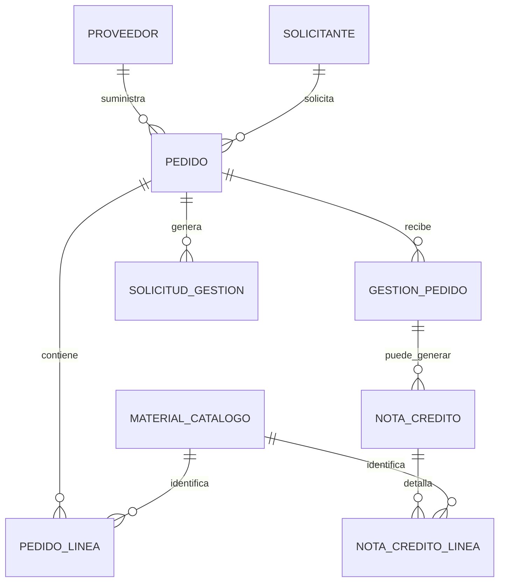

# Analisis de data para version 2.0

Archivo revisado: `C:\Users\Joel\Downloads\Seguimiento de Pedidos Ecuador.xlsx`

Fecha de analisis: 2026-05-29

## Resumen ejecutivo

El Excel no es solo una fuente de pedidos. Es un sistema operativo completo exportado desde AppSheet/Sheets con cabecera de pedidos, lineas por material, respuestas de proveedores, solicitudes de gestion, notas de credito, catalogo de materiales, seguimiento por proveedor, bitacora de sincronizacion y hojas sensibles de credenciales/contacto.

Para adaptar el prototipo con maxima coherencia, la version 2.0 no deberia seguir modelando un pedido como "un material + una cantidad". El Excel demuestra que un pedido tiene cabecera y multiples lineas de detalle. La app deberia migrar a un modelo:

- `pedido` como cabecera comercial/operativa.
- `pedido_linea` como materiales, cantidades, pendientes y valor.
- `gestion_pedido` como respuesta del proveedor.
- `nota_credito` y `nota_credito_linea` como flujo separado.
- `material_catalogo` deduplicado desde `MaterialesSum`.
- `proveedor`, `solicitante`, `sync_run` y `solicitud_gestion` como entidades auxiliares.

Hay datos sensibles en las hojas `Contrasenas`, `Respuestas de formulario 1` y en columnas como `ContrasenaUsada`. Esas credenciales no deben llegar al frontend ni guardarse en texto plano en Supabase.

## Inventario de hojas

| Hoja | Filas utiles | Columnas utiles | Rol en la app 2.0 |
|---|---:|---:|---|
| `Pedidos_AppSheet` | 30.346 | 15 | Cabecera maestra de pedidos ERP/AppSheet. |
| `Detalle_Pedidos_AppSheet` | 96.414 | 10 | Lineas de pedido por material. |
| `SYNC_LOG` | 50 | 6 | Auditoria de sincronizacion del archivo/origen. |
| `Respuesta Pedidos_AppSheet` | 663 | 26 | Respuestas/gestion de proveedores por pedido. |
| `Solicitudes` | 95 | 10 utiles, 12 visibles | Solicitudes internas de gestion al proveedor/equipo. |
| `Respuesta_NC_Detalle` | 367 | 7 | Lineas de materiales asociadas a respuestas de NC. |
| `Solicitudes_NC` | 415 | 13 | Cabecera del flujo de nota de credito. |
| `Consolidado NC` | 491 | 25 | Vista consolidada de NC; util para reportes, no como tabla fuente principal. |
| `Contrasenas` | 2 | 3 | Credenciales de proveedor/admin; excluir del frontend. |
| `MaterialesSum` | 133.475 | 3 | Catalogo de materiales, altamente duplicado. |
| `Seguimiento de pedidos ` | 41 | 3 | Resumen de respuesta por proveedor. |
| `Respuestas de formulario 1` | 13 | 6 | Contactos y credenciales de proveedores; tratar como sensible. |

## Relaciones principales

Cobertura detectada:

| Relacion | Cobertura |
|---|---:|
| `Pedidos_AppSheet.Numero de pedido` -> `Detalle_Pedidos_AppSheet.DocumentoVentas` | 28.198 de 30.346 pedidos tienen detalle: 92,92%. |
| `Pedidos_AppSheet.Orden de Compra` -> `Detalle_Pedidos_AppSheet.DocumentoCompras` | 28.093 de 30.226 OC enlazan: 92,94%. |
| `Respuesta Pedidos_AppSheet.Numero de pedido` -> `Pedidos_AppSheet.Numero de pedido` | 519 de 548 pedidos respondidos enlazan: 94,71%. |
| `Solicitudes.Pedido` -> `Pedidos_AppSheet.Numero de pedido` | 79 de 79 pedidos enlazan: 100%. |
| `Respuesta_NC_Detalle.RespuestaID` -> `Respuesta Pedidos_AppSheet.RespuestaID` | 274 de 278 respuestas enlazan: 98,56%. |
| `Solicitudes_NC.RespuestaID` -> `Respuesta Pedidos_AppSheet.RespuestaID` | 413 de 415 enlazan: 99,52%. |
| `Solicitudes_NC.Pedido` -> `Pedidos_AppSheet.Numero de pedido` | 364 de 393 pedidos enlazan: 92,62%. |
| `Consolidado NC.NC_ID` -> `Solicitudes_NC.NC_ID` | 404 de 404 NC enlazan: 100%. |
| `Detalle_Pedidos_AppSheet.CodMaterial` -> `MaterialesSum.Material` | 4.587 de 4.691 materiales enlazan: 97,78%. |
| `Respuesta_NC_Detalle.CodMaterial` -> `MaterialesSum.Material` | 221 de 222 materiales enlazan: 99,55%. |
| `Consolidado NC.CodMaterial` -> `MaterialesSum.Material` | 211 de 212 materiales enlazan: 99,53%. |

## Analisis hoja por hoja

### 1. `Pedidos_AppSheet`

Fuente primaria de cabecera. Cada fila representa un pedido comercial/ERP.

Campos relevantes:

- `Numero de pedido`: llave principal natural. 30.346 valores unicos.
- `Orden de Compra`: llave secundaria. 30.227 valores unicos; hay ordenes repetidas.
- `Nro Factura`: casi unico; 30.345 valores unicos.
- `Codigo Solicitante` y `Nombre del Solicitante`: dimension cliente/franquiciado. 654 codigos y 646 nombres.
- `Incoterm`: solo `FH` y `UN`.
- `Fecha de Pedido`: rango 2025-11-28 a 2026-05-28.
- `Proveedor`: 50 proveedores.
- `Valor Pedido`, `Valor Facturado`, `Valor Pendiente`: valores monetarios clave.
- `STATUS`: estado ERP/AppSheet.
- `MotivoPedido`, `CondicionPago`, `FechaAProcesarNC`: campos de regla comercial/NC.

Totales:

- Valor pedido total: 56.188.759,03.
- Valor facturado total: 53.353.318,09.
- Valor pendiente total: 2.514.565,50.
- Valor pendiente en estados abiertos/NC: 2.500.006,78.

Distribucion de `STATUS`:

- `7. Pedido Entregado y Facturado`: 27.202.
- `1. Pedido Pendiente por Despacho`: 1.308.
- `10. Pedido Anulado / Nota Credito`: 901.
- `3. Pedido Parcialmente Entregado`: 526.
- `4. Pedido Pendiente por Retiro`: 220.
- `5. Pedido Parcialmente Retirado`: 76.
- `11. Pedido Parcialmente Facturado y Ajustado en el Sistema`: 72.
- `9. Nota Credito Pendiente de Emision`: 30.
- `8. Nota Credito Sin Confirmar`: 11.

Uso recomendado:

- Crear tabla `pedidos_erp`.
- Mantener `status_erp` textual original.
- Derivar `estado_operativo` para compatibilidad con la app.
- Usar `Numero de pedido` como codigo publico/consulta.
- Usar `Codigo Solicitante` y `Nombre del Solicitante` para una tabla `solicitantes`.
- Usar `Proveedor` para tabla `proveedores`.

### 2. `Detalle_Pedidos_AppSheet`

Fuente primaria de materiales por pedido. Aunque la hoja tiene muchas filas formateadas, hay 96.414 lineas utiles.

Campos:

- `DocumentoCompras`: enlaza con `Orden de Compra`.
- `DocumentoVentas`: enlaza con `Numero de pedido`.
- `CodMaterial`: codigo del material.
- `NombreMaterial`: descripcion del material.
- `CantidadPedido`: cantidad solicitada por linea.
- `ValorNeto`: valor de linea.
- `CantidadPendiente`: cantidad no cubierta.
- `MotivoPedido`, `CondicionPago`, `FechaAProcesarNC`: replica campos comerciales a nivel linea.

Totales:

- 28.198 pedidos distintos con detalle.
- 4.691 codigos de material distintos.
- 96.414 lineas.
- 5.403 lineas tienen `CantidadPendiente > 0`.
- Cantidad pedida total: 6.920.835,41.
- Cantidad pendiente total: 354.445,28.
- Promedio de lineas por pedido: 3,42; maximo: 25.

Uso recomendado:

- Crear tabla `pedido_lineas`.
- La pantalla `Pedidos` debe mostrar cabecera y permitir expandir lineas.
- La pagina `Materiales` debe usar estas lineas para demanda pendiente, no como stock real.

### 3. `SYNC_LOG`

Bitacora de sincronizacion.

Campos:

- `FechaHora`
- `Estado`
- `Pedidos actualizados`
- `Detalle actualizado`
- `Usuario`
- `Error`

Hallazgos:

- 50 ejecuciones.
- 46 `OK`, 3 `ERROR`, 1 `TRIGGERS INSTALADOS`.
- Rango 2026-05-17 a 2026-05-28.

Uso recomendado:

- Crear tabla `sync_runs`.
- En `EstadoSistema`, mostrar ultima sincronizacion, volumen importado y errores recientes.

### 4. `Respuesta Pedidos_AppSheet`

Gestion registrada por proveedores/equipo sobre pedidos.

Campos clave:

- `RespuestaID`: llave primaria de respuesta.
- Datos replicados de pedido: numero, OC, factura, solicitante, proveedor, valores y status.
- `Tipo de entrega`: `COMPLETA` o `PARCIAL`.
- `Fecha de la Ultima Gestion`.
- `Status Gestion`: decision operativa del proveedor/equipo.
- `MotivoGestion`: causa normalizada.
- `Comentario`.
- `Fecha tentativa de entrega`.
- `ProveedorLogin`, `ContrasenaUsada`: sensibles.
- `NumeroInternoProducto`: referencia interna del proveedor.

Distribucion:

- 663 respuestas.
- 548 pedidos distintos.
- 519 pedidos existen en `Pedidos_AppSheet`.
- `COMPLETA`: 375; `PARCIAL`: 288.

`Status Gestion`:

- Proceder con NC parcial: 271.
- Despachado en su totalidad: 184.
- Proceder con NC total: 142.
- En coordinacion para despacho: 43.
- Pendiente por produccion/stock: 7.
- Despacho parcial: 7.
- Venta recupera / NC anulada: 5.
- Franquicia retira: 3.
- Devolucion de material: 1.

`MotivoGestion`:

- Falta de stock: 103.
- Se desiste de compra: 63.
- Error cliente: 60.
- Cambio de condiciones comerciales: 26.
- No cumple minimo: 25.

Uso recomendado:

- Crear tabla `gestiones_pedido`.
- Mostrar la ultima gestion en el detalle de pedido.
- No exponer `ContrasenaUsada`.
- Derivar `accion_solicitante`:
  - NC total/parcial -> `nota_credito`.
  - En coordinacion/despacho/franquicia retira/despachado -> `despachar`.
  - Pendiente produccion/stock -> `esperar_pedido`.

### 5. `Solicitudes`

Solicitudes internas de gestion.

Campos:

- `SolicitudID`
- `Pedido`
- `Tipo`
- `Mensaje`
- `Estado`
- `FechaSolicitud`
- `SolicitadoPor`
- `FechaAtendido`
- `AtendidoPor`
- `ArchivoGuia`

La vista inicial tambien trae `NumeroGuia` y `FechaGuia`, pero estan vacios en la data util.

Hallazgos:

- 95 solicitudes.
- 79 pedidos distintos, todos enlazan contra cabecera.
- 51 atendidas y 43 pendientes; una fila sin estado.

Uso recomendado:

- Crear tabla `solicitudes_gestion`.
- En `Alertas` o detalle del pedido mostrar solicitudes pendientes.
- `ArchivoGuia` puede convertirse en adjunto/documento.

### 6. `Respuesta_NC_Detalle`

Detalle de materiales que entran en una nota de credito.

Campos:

- `LineaID`
- `RespuestaID`
- `CodMaterial`
- `NombreMaterial`
- `CantidadPendiente`
- `CantidadNC`
- `NumeroFb`

Hallazgos:

- 367 lineas.
- 278 respuestas distintas.
- 222 materiales.
- 274 de 278 respuestas enlazan con `Respuesta Pedidos_AppSheet`.

Uso recomendado:

- Crear tabla `nota_credito_lineas` o `respuesta_nc_lineas`.
- No mezclar con `pedido_lineas`, porque esta tabla representa lo que se gestiona como NC.

### 7. `Solicitudes_NC`

Cabecera del flujo de nota de credito.

Campos:

- `NC_ID`
- `RespuestaID`
- `Pedido`
- `Proveedor`
- `MotivoNC`: `NC_PARCIAL` o `NC_TOTAL`.
- `MotivoGestion`
- `Comentario`
- `EstadoNC`
- `FechaCreacion`
- `CreadoPor`
- `FechaResuelto`
- `ResueltoPor`
- `ComentarioEquipoNC`

Hallazgos:

- 415 solicitudes.
- 401 resueltas y 14 pendientes.
- 273 NC parciales y 142 NC totales.
- Motivos principales: falta de stock, error cliente, desistimiento, cambio comercial, minimo no cumplido.

Uso recomendado:

- Crear tabla `notas_credito`.
- Mostrar en pagina propia `Notas de credito` o como tab dentro de `Reportes`.
- Alimentar alertas cuando `EstadoNC = PENDIENTE`.

### 8. `Consolidado NC`

Vista ya consolidada de cabecera NC + detalle material + datos del pedido.

Uso recomendado:

- Usarla para validacion y reportes.
- No usarla como fuente principal si ya se importan `Solicitudes_NC` y `Respuesta_NC_Detalle`, porque duplica informacion.

Hallazgos:

- 491 lineas.
- 404 NC distintas.
- 479 resueltas y 12 pendientes.
- 356 lineas tienen material asociado; las NC totales pueden no tener material por linea.

### 9. `Contrasenas`

Hoja sensible con proveedor, contrasena sugerida y email.

Uso recomendado:

- No importarla al frontend.
- No guardarla en Supabase como texto plano.
- Si se requiere autenticacion de proveedores, usar Supabase Auth o una tabla server-only con hash/secret manager.

### 10. `MaterialesSum`

Catalogo de materiales.

Campos:

- `Material`: codigo.
- `Texto breve de material`: descripcion.
- `NroFb`: codigo/referencia FB.

Hallazgos:

- 133.475 filas.
- 11.134 materiales unicos.
- 11.036 descripciones unicas.
- 122.341 duplicados exactos.
- No se detectaron codigos con mas de una descripcion.

Uso recomendado:

- Deduplicar por `Material`.
- Crear `material_catalogo`.
- Conectar `pedido_lineas.CodMaterial` a `material_catalogo.Material`.
- Mantener la tabla actual `materiales` del prototipo solo si representa inventario real. El Excel no trae `stock_actual` ni `stock_minimo`.

### 11. `Seguimiento de pedidos `

Resumen por proveedor.

Campos:

- `Proveedor`
- `Pedidos toales`
- `Pedidos respondidos`

Hallazgos:

- 41 proveedores.
- 3.139 pedidos reportados en seguimiento.
- 529 respondidos.
- 2.610 pendientes.

Proveedores con mas pendientes:

- INTACO ECUADOR S. A.: 597 pendientes.
- MEXICHEM ECUADOR S.A.: 544 pendientes.
- ACERIAS NACIONALES DEL ECUADOR S.A.: 242 pendientes.
- IDEAL ALAMBREC S. A.: 211 pendientes.
- PINTURAS UNIDAS S. A.: 152 pendientes.
- IPAC S.A.: 135 pendientes.
- Holcim Ecuador S.A.: 113 pendientes.
- L. HENRIQUES Y CIA. S.A.: 105 pendientes.
- SIKA ECUATORIANA S.A: 105 pendientes.
- ACERIA DEL ECUADOR CA ADELCA: 88 pendientes.

Uso recomendado:

- Crear vista `proveedor_kpis`.
- Dashboard 2.0 debe mostrar tasa de respuesta, pendientes por proveedor y proveedores criticos.

### 12. `Respuestas de formulario 1`

Formulario de proveedores/contacto.

Campos:

- Marca temporal.
- Compania.
- Contrasena.
- Correos de contacto.
- Celular.

Uso recomendado:

- Tratar como dato sensible.
- Extraer solo compania/contacto si hay base legal/operativa.
- Nunca mostrar contrasenas en UI.

## Mapeo contra el prototipo actual

| Prototipo actual | Excel 2.0 | Ajuste recomendado |
|---|---|---|
| `Pedido.codigo` | `Numero de pedido` | Usar numero ERP como codigo principal y codigo de consulta. |
| `Pedido.material` | `Detalle_Pedidos_AppSheet.NombreMaterial` | Mover a lineas; un pedido puede tener varios materiales. |
| `Pedido.cantidad` | `CantidadPedido` | Debe vivir en `pedido_lineas`. |
| `Pedido.cantidad_despacho` | `CantidadPendiente` | Usar como cantidad operativa pendiente por linea. |
| `Pedido.stock_disponible` | No existe stock real en Excel | No inventar stock; usar `CantidadPendiente` como demanda y conservar inventario real aparte. |
| `Pedido.solicitante` | `Nombre del Solicitante` | Crear dimension `solicitantes`. |
| `cedula_solicitante` | No existe cedula/RUC directa; existe `Codigo Solicitante` | Cambiar label a codigo solicitante o agregar campo separado si luego hay RUC. |
| `origen/destino` | `Proveedor`, `Incoterm`, estado ERP | Derivar proveedor como origen externo; destino como solicitante/franquiciado. |
| `fecha_solicitud` | `Fecha de Pedido` | Mapeo directo. |
| `fecha_compromiso` | `Fecha tentativa de entrega` o `FechaAProcesarNC` | Definir `fecha_objetivo` segun flujo despacho/NC. |
| `urgencia` | Derivada | Calcular por pendiente, antiguedad, valor, NC pendiente y proveedor. |
| `estado` | `STATUS` + `Status Gestion` + `EstadoNC` | Preservar estado crudo y derivar estado operativo. |
| `accion_solicitante` | `Status Gestion`, `MotivoNC`, `EstadoNC` | NC -> `nota_credito`; coordinacion/despacho -> `despachar`; produccion/stock -> `esperar_pedido`. |
| `condicion_material` | `MotivoGestion` y cantidad pendiente | Falta stock/produccion -> `no_planificable`; minimo -> `restrictivo`; coordinacion/despacho -> `urgente_despacho`. |
| `Material` | `MaterialesSum` | Crear catalogo deduplicado; no confundir con inventario. |
| `Alertas` | Derivadas de pendientes, NC, proveedor sin responder, sync errors | Expandir reglas de alerta. |
| `Reportes` | `Seguimiento de pedidos`, `Consolidado NC`, agregados de detalle | Convertir reportes en vistas derivadas. |

## Mapeo de estados recomendado

Preservar siempre el estado original en `status_erp`. Derivar un `estado_operativo` para mantener la UI simple.

| `STATUS` origen | `estado_operativo` actual | Campo adicional recomendado |
|---|---|---|
| `1. Pedido Pendiente por Despacho` | `pendiente` | `flujo = despacho` |
| `3. Pedido Parcialmente Entregado` | `en_despacho` | `es_parcial = true` |
| `4. Pedido Pendiente por Retiro` | `aprobado` | `flujo = retiro` |
| `5. Pedido Parcialmente Retirado` | `en_despacho` | `flujo = retiro`, `es_parcial = true` |
| `7. Pedido Entregado y Facturado` | `entregado` | `cerrado_comercial = true` |
| `8. Nota Credito Sin Confirmar` | `en_revision` | `flujo = nota_credito`, `estado_nc = sin_confirmar` |
| `9. Nota Credito Pendiente de Emision` | `en_revision` | `flujo = nota_credito`, `estado_nc = pendiente_emision` |
| `10. Pedido Anulado / Nota Credito` | `cancelado` o `en_revision` si NC pendiente | `flujo = nota_credito` |
| `11. Pedido Parcialmente Facturado y Ajustado en el Sistema` | `entregado` | `estado_financiero = ajustado` |

Regla adicional: si `MotivoGestion = FALTA DE STOCK` o `Status Gestion` contiene produccion/stock, el pedido debe aparecer como `sin_stock` o como alerta critica aunque el estado ERP sea parcial.

## Modelo de base sugerido

### `proveedores`

- `id`
- `nombre`
- `contacto_email`
- `contacto_telefono`
- `created_at`

No incluir contrasenas en esta tabla.

### `solicitantes`

- `codigo_solicitante`
- `nombre`
- `created_at`

### `material_catalogo`

- `codigo_material`
- `nombre_material`
- `numero_fb`
- `created_at`
- `updated_at`

### `pedidos_erp`

- `id`
- `numero_pedido`
- `orden_compra`
- `numero_factura`
- `codigo_solicitante`
- `proveedor_id`
- `incoterm`
- `fecha_pedido`
- `valor_pedido`
- `valor_facturado`
- `valor_pendiente`
- `status_erp`
- `estado_operativo`
- `motivo_pedido`
- `condicion_pago`
- `fecha_a_procesar_nc`
- `fecha_objetivo`
- `prioridad_calculada`
- `created_at`
- `updated_at`

### `pedido_lineas`

- `id`
- `pedido_id`
- `documento_compras`
- `documento_ventas`
- `codigo_material`
- `nombre_material_snapshot`
- `cantidad_pedido`
- `cantidad_pendiente`
- `valor_neto`
- `motivo_pedido`
- `condicion_pago`
- `fecha_a_procesar_nc`

### `gestiones_pedido`

- `respuesta_id`
- `pedido_id`
- `tipo_entrega`
- `fecha_ultima_gestion`
- `status_gestion`
- `motivo_gestion`
- `comentario`
- `fecha_tentativa_entrega`
- `respondido_por`
- `proveedor_login`
- `numero_interno_producto`

Excluir `ContrasenaUsada`.

### `solicitudes_gestion`

- `solicitud_id`
- `pedido_id`
- `tipo`
- `mensaje`
- `estado`
- `fecha_solicitud`
- `solicitado_por`
- `fecha_atendido`
- `atendido_por`
- `archivo_guia`

### `notas_credito`

- `nc_id`
- `respuesta_id`
- `pedido_id`
- `proveedor_id`
- `motivo_nc`
- `motivo_gestion`
- `comentario`
- `estado_nc`
- `fecha_creacion`
- `creado_por`
- `fecha_resuelto`
- `resuelto_por`
- `comentario_equipo_nc`

### `nota_credito_lineas`

- `linea_id`
- `respuesta_id`
- `nc_id`
- `codigo_material`
- `nombre_material_snapshot`
- `cantidad_pendiente`
- `cantidad_nc`
- `numero_fb`

### `sync_runs`

- `fecha_hora`
- `estado`
- `pedidos_actualizados`
- `detalle_actualizado`
- `usuario`
- `error`

## Pantallas 2.0 recomendadas

### Dashboard

KPI principales:

- Pedidos totales.
- Pedidos abiertos.
- Valor pendiente.
- Lineas con cantidad pendiente.
- NC pendientes.
- Proveedores sin respuesta.
- Ultima sincronizacion y errores.

Bloques:

- Top proveedores pendientes.
- Top materiales con cantidad pendiente.
- Pedidos criticos por fecha objetivo/valor.
- Alertas de NC pendientes.

### Pedidos

Debe cambiar de tabla plana a cabecera con detalle expandible:

- Cabecera: numero pedido, proveedor, solicitante, fecha, valor pendiente, status ERP, estado operativo, prioridad.
- Expansion: lineas de materiales con cantidad pedida, pendiente, valor neto y codigo material.
- Panel lateral: respuestas del proveedor, solicitudes, NC, historial.

Filtros:

- Proveedor.
- Solicitante.
- STATUS ERP.
- Estado operativo.
- Motivo gestion.
- Motivo pedido.
- Fecha pedido.
- Fecha objetivo.
- Tiene cantidad pendiente.
- Tiene NC pendiente.

### Materiales

Separar dos conceptos:

- Catalogo: deduplicado desde `MaterialesSum`.
- Demanda pendiente: sumatoria de `CantidadPendiente` desde lineas.

No llamar `stock_actual` a la cantidad pendiente. Si se mantiene inventario real, debe venir de otra fuente o capturarse manualmente.

### Notas de credito

Pantalla propia o tab de Reportes:

- NC pendientes/resueltas.
- Motivo.
- Pedido.
- Proveedor.
- Lineas/materiales.
- Comentario del equipo NC.

### Proveedores

Nueva vista util para operaciones:

- Total pedidos.
- Respondidos.
- Pendientes.
- Tasa de respuesta.
- Ultima gestion.
- Pedidos abiertos.

### Carga masiva

El prototipo actual solo importa CSV. Para 2.0 debe aceptar `.xlsx` directo y mostrar un preview:

- Hojas detectadas.
- Filas utiles.
- Duplicados.
- Errores de relacion.
- Hojas sensibles omitidas.
- Resumen antes de confirmar importacion.

## Reglas de prioridad 2.0

El calculo actual prioriza por urgencia, stock, tiempo y tipo de cliente. Con esta data, conviene ajustar:

- `valor_pendiente`: mas valor pendiente sube prioridad.
- `cantidad_pendiente`: lineas con pendiente suben prioridad.
- `status_erp`: NC pendiente/sin confirmar y pendiente despacho son criticos.
- `motivo_gestion`: falta de stock, minimo no cumplido o produccion/stock suben prioridad.
- `fecha_objetivo`: si esta vencida al 2026-05-29, sube prioridad.
- `proveedor`: baja tasa de respuesta sube prioridad.
- `EstadoNC = PENDIENTE`: alerta alta o critica.

## Alertas derivadas

Alertas recomendadas:

- Pedido pendiente sin detalle: 2.148 casos detectados.
- Material de detalle no encontrado en catalogo: 104 codigos.
- Respuesta de proveedor sin pedido en cabecera: 29 pedidos.
- Solicitud NC con pedido no encontrado: 29 pedidos.
- Detalle NC sin respuesta enlazada: 4 respuestas.
- Detalle duplicado exacto: 540 lineas.
- Fecha tentativa sospechosa: se detecta una fecha minima 2006-05-22.
- Fechas con formato mixto: `FechaCreacion` usa formato tipo `03/21/2026`, mientras otras columnas usan `yyyy-mm-dd`.
- Error de sincronizacion en `SYNC_LOG`: 3 errores registrados.

## Decisiones clave antes de implementar

1. Mantener `status_erp` original y derivar `estado_operativo`, no reemplazarlo.
2. Migrar pedidos a cabecera + lineas.
3. Tratar `MaterialesSum` como catalogo, no como inventario.
4. Separar flujo de despacho y flujo de nota de credito.
5. No importar credenciales al cliente.
6. Crear importacion idempotente por llave natural (`numero_pedido`, `respuesta_id`, `nc_id`, `linea_id`) y hash de fila.
7. Validar fechas con formato explicito para evitar confundir mayo 12 con diciembre 5.

## Orden recomendado de implementacion

1. Crear migracion Supabase 2.0 con tablas normalizadas y vistas de compatibilidad.
2. Crear parser/importador XLSX para las 12 hojas, omitiendo credenciales sensibles.
3. Importar a tablas 2.0 con llaves naturales idempotentes y registrar incoherencias en `import_errores_2_0`.
4. Adaptar tipos TypeScript.
5. Refactorizar `Pedidos` para cabecera + lineas.
6. Crear paginas/vistas de `Notas de credito` y `Proveedores`.
7. Ajustar Dashboard, Alertas y Reportes a los nuevos KPIs.
8. Mantener una vista compatible con el `Pedido` actual mientras se migra UI.
